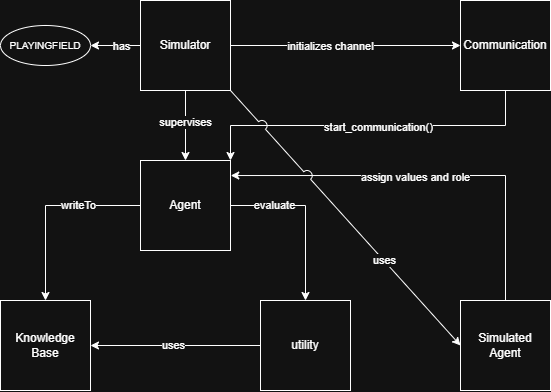
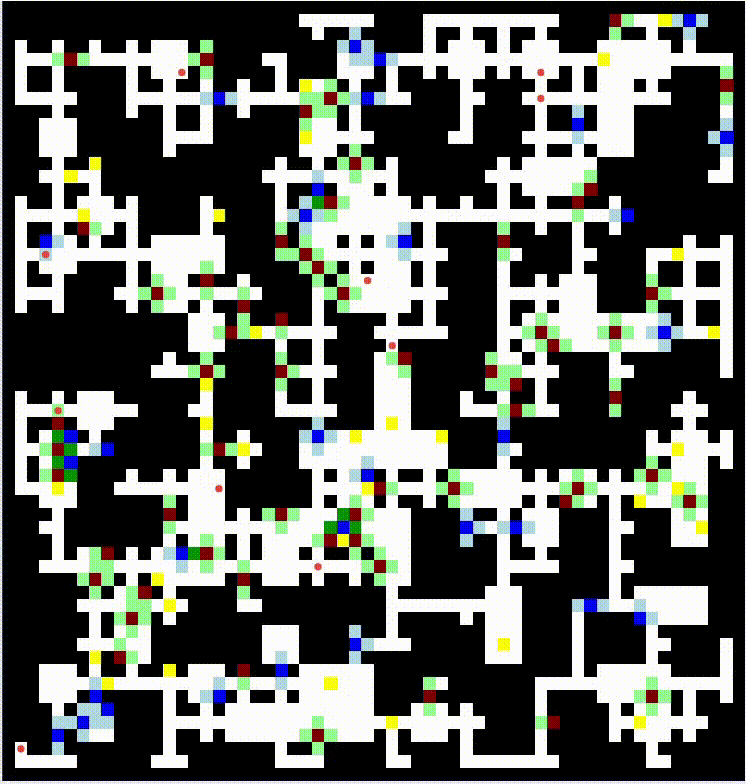
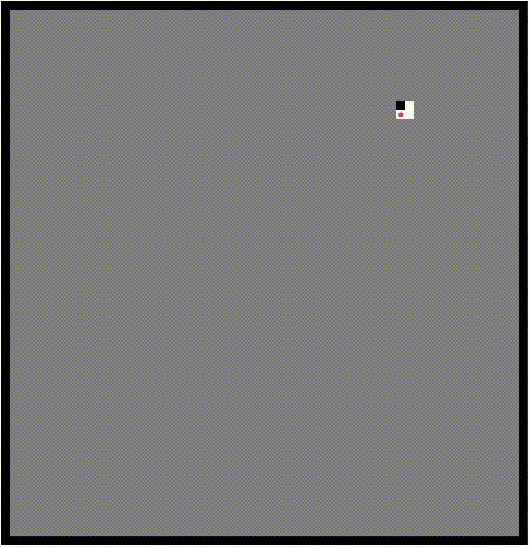

<h1 align="center">Multi-Agent Wumpus-World</h1>
<div align="center">
  
[![Unlicense License][license-shield]][license-url]
</div>
<details>
  <summary>Table of Contents</summary>
  <ol>
    <li>
      <a href="#about-the-project">About The Project</a>
      <ul>
        <li><a href="#built-with">Built With</a></li>
        <li><a href="#rough-structural-diagram">Rough structural diagram</a>
      </ul>
    </li>
    <li>
      <a href="#agents">Agents</a>
      <ul>
        <li><a href="#agent-classes">Agent classes</a></li>
      </ul>
    </li>
    <li><a href="#map">Map</a></li>
    <ul>
      <li><a href="#brief-explanation-of-the-world">Brief explanation of the world</a></li>
    </ul>
    <li><a href="#knowledge-base">Knowledge Base</a></li>
    <ol>
      <li><a href="#possible-states-of-a-field">Possible states of a field</a></li>
      <li><a href="#example-prediction">Example prediction</a></li>
    </ol>
    <li><a href="#demo">Demo</a></li>
    <li><a href="#how-to-use">How to use</a></li>
  </ol>
</details>

## About the project
is an extension of the [wumpus game](https://de.wikipedia.org/wiki/Wumpus-Welt) by a multi-agent environment approach with
- communication between agents
- different classes of agents with different focuses
- A*-algorithm (heuristic: utility function coupled with the Manhatten distance) as the traversal algorithm through the map

### Rough structural diagram


### Build with
[![Python][Python]][Python-url]

## Agents
<ul>
  <li>in general the agents are risk-avoidant in the context of exploring the map, meaning they won't walk on ◊Wumpus or ◊Pit tiles (for context see section <a href="#map">Map</a>)</li>
  <li>agents were implemented as being selfish as they follow their own goal</li>
</ul>

### Agent classes
<ol>
  <li>Hunter</li>
  <ul>
    <li>can kill wumpi with an arrow whose range is his von neumann neighbourhood</li>
    <li>arrow replenishes every 32 rounds</li>
    <li>prioritizes killing wumpi</li>
  </ul>
  <li>Cartograph</li>
  <ul>
    <li>has a map of all the tiles with condition "WALL" (ref)</li>
    <li>prioritizes map progress</li>
  </ul>
  <li>Knight</li>
  <ul>
    <li>can kill wumpi by standing on its inhabited tile every 32 rounds</li>
    <li>if the knight steps on a wumpi without waiting for the replenish, it dies</li>
    <li>prioritizes gold and killing wumpi</li>
  </ul>
  <li>BWL-Student</li>
  <ul>
    <li>can sniff out gold tiles through a radius of 5 tiles</li>
    <li>prioritizes gold</li>
  </ul>
</ol>

## Map
<table>
  <tr>
    <td>
    <td>⬛ <strong>Black:</strong> Wall<br>🟥 <strong>Red:</strong> Wumpus<br>🟩 <strong>Green:</strong> Stench<br>🟦 <strong>Blue:</strong> Pit<br>🟦 <strong>Light Blue:</strong> Breeze<br>🟨 <strong>Yellow:</strong> Shiny<br>🟠 <strong>Orange:</strong> Agent
      </ul>
    </td>
  </tr>
</table>

### Brief explanation of the world
<ul>
  <li>a wumpus is always surrounded by stenches</li>
  <li>a pit is always surrounded by breezes</li>
  <li>stepping on a wumpus tile or a pit tile leads to the agent dying</li>
  <li>walls cannot be stepped upon
  <li>collecting gold by stepping on it stores it inside the agents inventory</li>
</ul>

## Knowledge Base
### Possible states of a field

<table>
  <tr>
    <th rowspan="2">Allowed additional states</th>
    <th colspan="7">Field states that are mutually exclusive</th>
  </tr>
  <tr>
    <th>Safe</th>
    <th>Wumpus</th>
    <th>Pit</th>
    <th>Wall</th>
    <th>Unknown (1)</th>
    <th>Unknown (2)</th>
    <th>Unknown (3)</th>
  </tr>
  <tr>
    <td><strong>Stench</strong></td>
    <td>🟩</td><td>🟥</td><td>🟥</td><td>🟥</td><td>🟩</td><td>🟥</td><td>🟥</td>
  </tr>
  <tr>
    <td><strong>Breeze</strong></td>
    <td>🟩</td><td>🟩</td><td>🟥</td><td>🟥</td><td>🟥</td><td>🟩</td><td>🟥</td>
  </tr>
  <tr>
    <td><strong>Shiny</strong></td>
    <td>🟩</td><td>🟥</td><td>🟥</td><td>🟥</td><td>🟥</td><td>🟥</td><td>🟥</td>
  </tr>
  <tr>
    <td><strong>◊Wumpus</strong></td>
    <td>🟥</td><td>🟥</td><td>🟥</td><td>🟥</td><td>🟥</td><td>🟩</td><td>🟩</td>
  </tr>
  <tr>
    <td><strong>◊Pit</strong></td>
    <td>🟥</td><td>🟥</td><td>🟥</td><td>🟥</td><td>🟩</td><td>🟥</td><td>🟩</td>
  </tr>
</table>
<i>Note: the logical ◊ operator stands for a possibility</i>

<ul>
  <li>the knowledge base of an agent uses predicate logic and modal logic approaches to deduce new from old knowledge through predictions and re-predictions</li>
  <li>Unknown (1|2|3) means that the state of the tile condition is to be deduced through further knowledge</li>
  <li>predictions are marked accordingly in the map through pink for "◊Wumpus" and teal for "◊Pit"</li>
</ul>

### Example prediction


## Communication
<ul>
  <li>communication (1:n) happens if it helps the agent to achieve his goal quicker</li>
  <li>the trading objects that can be exchanged in a communication are</li>
  <ul>
    <li>gold</li>
    <li>tile information</li>
    <li>wumpus kill tasks</li>
  </ul>
  <li>agents can only communicate with agents on the same tile</li>
  <li>if an agent wants to initiate a communication, it creates a channel</li>
  <li>the implementation of the communication follows the contract net protocol</li>
  <li>here a brief sequence of steps after the initialization of the channel</li>
  <ol>
    <li>initiator requests a trading object</li>
    <li>participants decide if to join the communication</li>
    <li>if joined, they will give their offers</li>
    <li>initiator evaluates offer</li>
    <li>if satisfying offers found, choose the best</li>
    <li>if no satisfying offers found $\forall$ participants, go into negotiation (max 3 rounds)</li>
  </ol>
  <li>to briefly summarize the negotiation: the initiator asks for new offers and the process repeats itself; if an agent does not have a better offer, it leaves the communication entirely</li>
  <li>if no satisfying deal is found after the 3 negotiation rounds, the communication is discontinued without a result</li>
</ul>

## Demo
| **Full View** | **Agent View** |
|:------------:|:-------------:|
|  |  |

*(you can hover over every tile and get information about the tile, conditions and agents)*

## How to use
  1. Clone the repository
  ```sh
  git clone https://github.com/Zatzi08/Wumpus.git
  cd Wumpus
  ```
  2. Install requirements (requires Python 3.12+)
  ```sh
  pip install -r .\requirements.txt
  ```
  3. Run `visualizer.py` to start the Dash App
  4. Copy the local host url that Dash created from the console into your prefered browser
  5. if changing the parameters of the Simulator is desired change this line of code in `visualizer.py`
  ```py
  simulator = Simulator(MAP_WIDTH, MAP_HEIGHT, NUMBER_OF_AGENTS, NUMBER_OF_MAX_SIMULATION_STEPS, seed=SEED, with_communication=INSERT_BOOLEAN)
  ```
<table>
  <thead>
    <tr>
      <th>Parameter</th>
      <th>Description</th>
    </tr>
  </thead>
  <tbody>
    <tr>
      <td><code>MAP_WIDTH</code></td>
      <td>sets the map width</td>
    </tr>
    <tr>
      <td><code>MAP_HEIGHT</code></td>
      <td>sets the map height</td>
    </tr>
    <tr>
      <td><code>NUMBER_OF_AGENTS</code></td>
      <td>spawns agents in random spawn locations (excluding pit, wumpus, and wall tiles) with agent classes being randomly chosen</td>
    </tr>
    <tr>
      <td><code>NUMBER_OF_MAX_SIMULATION_STEPS</code></td>
      <td>upper border; after the specified number is reached, no further steps are calculated (view remains unchanged)</td>
    </tr>
    <tr>
      <td><code>seed</code></td>
      <td>seed to allow for reproducibility of a simulation</td>
    </tr>
    <tr>
      <td><code>with_communication</code></td>
      <td>choose if communication is allowed; if set to true, it


<!-- MARKDOWN LINKS & IMAGES -->
[Python]: https://img.shields.io/badge/python-3670A0?style=for-the-badge&logo=python&logoColor=ffdd54
[Python-url]: https://www.python.org/
[license-shield]: https://img.shields.io/github/license/othneildrew/Best-README-Template.svg?style=for-the-badge
[license-url]: https://github.com/Zatzi08/Wumpus/blob/main/LICENSE
